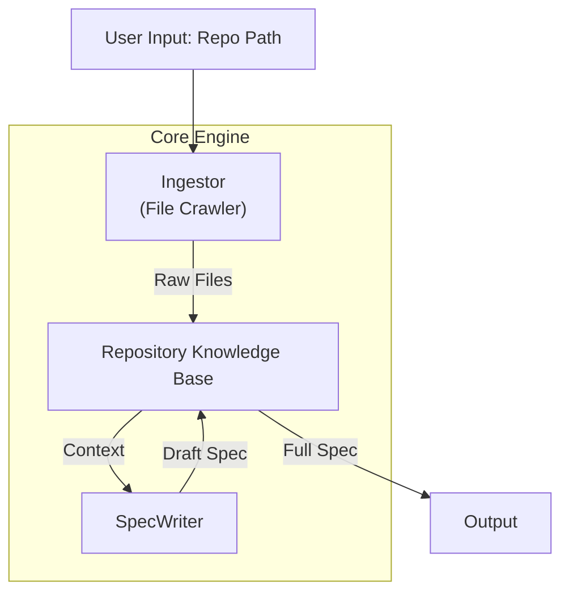

### File: `README.md`

# Semantic Spec Evolver
**A Self-Correcting "Round-Trip" Logic Extraction Engine**

## 1. The Core Concept
This project solves the "Ground Truth" problem in LLM prompt engineering. 
Most prompt optimization systems rely on subjective evaluation ("Is this output good?"). 
**Semantic Spec Evolver** relies on objective **Behavioral Equivalence**.

### The "Round-Trip" Test
We prove a Natural Language Specification is "perfect" if a blind agent can use it to reconstruct the original code's behavior exactly.

1.  **Reverse Engineering:** LLM reads `Legacy Code` $\to$ writes `English Spec`.
2.  **Blind Reconstruction:** Different LLM reads `English Spec` (without seeing code) $\to$ writes `New Code`.
3.  **The "Critic":** We run `Legacy Code` vs `New Code` on random inputs.
4.  **Evolution:** If outputs mismatch, the **Optimizer** refines the `English Spec`.

---

## 2. Architecture (v2: Repository Aware)

[Image of System Architecture Diagram]



* **The Ingestor:** Crawls directory trees, filters junk (binary, git), and loads raw content.
* **The Spec Writer:** Uses versioned prompts to convert code into UML-like specs.
* **The Repo State:** (In Progress) Holds the file graph and dependencies.

---

## 3. Project Structure

```text
semantic-spec-evolver/
├── core/
│   ├── engine.py                   # Orchestrator
│   ├── ingestor.py                 # File Crawler (New)
│   ├── spec_writer.py              # Logic Extractor
│   ├── prompts.py                  # Versioned System Prompts
│   └── critic.py                   # The Judge
│
├── sandbox/                        # Test Data
│   └── source_logic.py             # Legacy Code
│
├── tests/
│   ├── test_ingestor.py            # Unit Tests for Crawler
│   ├── test_repo_integration.py    # Integration Tests (Ingestor -> SpecWriter)
│   └── ...

```

## 4. Current Status

* **[x] Phase 1: Infrastructure:** Engine, Critic, and LLM Client are stable.
* **[x] Phase 2a: Ingestion:** `Ingestor` correctly identifies and reads valid source files.
* **[x] Phase 2b: Generation:** `SpecWriter` produces Markdown specs with Mermaid diagrams.
* **[ ] Phase 2c: Knowledge Base:** Creating the `Repository` class to manage file state.

---
