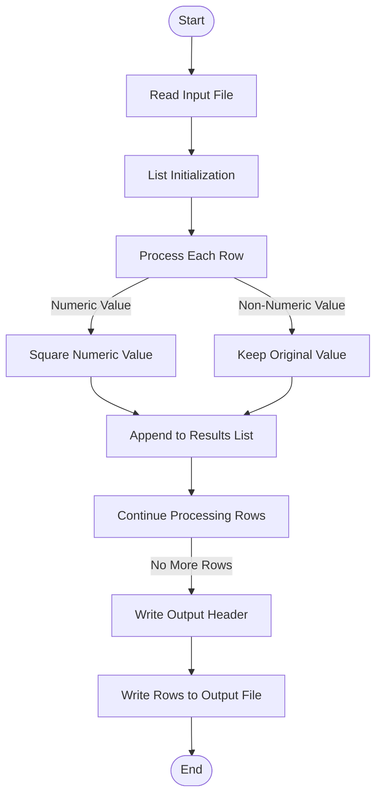

# System Specification: Data Processing System

## 1. Overview
This system processes a CSV file containing a column named 'value'. It checks if the values in this column are numeric and squares them if they are. If not, it leaves the value unchanged. The processed data is then saved to a new CSV file.

## 2. Data Contract
### Inputs
* **Format:** CSV
* **Schema:**
  - Column Name: `value`
  - Data Type: String

### Outputs
* **Format:** CSV
* **Schema:**
  - Column Names: `original`, `squared`
  - Data Types: String, Numeric (or unchanged)

## 3. Logic Specification
1. **Read Input File:**
   - Open the input CSV file and read its contents.
   
2. **Initialize Results List:**
   - Create an empty list to store processed rows.

3. **Process Each Row:**
   - For each row in the input file:
     1. Retrieve the value from the 'value' column.
     2. Attempt to convert the value to a float.
        - If successful, square the numeric value.
        - If unsuccessful (ValueError), keep the original value unchanged.
     3. Append a dictionary with the original and processed values to the results list.

4. **Write Output File:**
   - Open the output CSV file for writing.
   - Write the header row (`original`, `squared`).
   - Write each row from the results list to the output file.

## 4. Visual Flow

This flowchart illustrates the logical steps involved in reading the input file, processing each row based on whether the 'value' column is numeric or not, and writing the processed data to an output file.